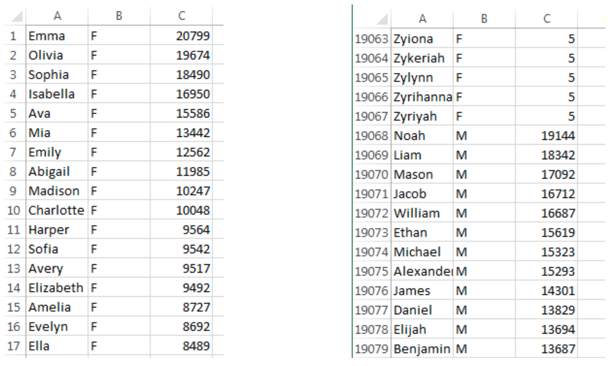

# Project: Baby Names Data Analysis

## Summary

This project does data analysis on baby names data from the United States. Specifically, it solves the following problems:

- Calculates **the number of girls names**, **the number of boys names** and **the total names** in a single year.
- Calculates **the number of girls**, **the number of boys** and **the total births** in a single year.
- Calculates **the rank of a particular name and gender** in a particular year.
- Finds **the name at a particular rank and gender** in a particular year.
- Finds out what would be **the hypothetical name in an hypothetical year** based on the given name, gender and actual year of birth, **based on popularity**.
- Calculates **the year of highest rank** for a given name and gender across a selection of years.
- Calculates **the average rank** for a given name and gender across a selection of years.
- Calculates **the number of total births that were ranked higher** than the given name and gender in a particular year.

## Data

- We are providing data on baby names from the United States.
- The data files give information on the first names of people born in a particular year.
- We have data from 1880 through 2014 on both boys and girls names.
- You can download a .zip folder of all baby name data by clicking [here](http://www.dukelearntoprogram.com/course2/data/us_babynames.zip).
- The file lists all the girls first, and they are listed in order based on the number of births, from largest numbers to smallest numbers.
- Then all the boys are listed next in the order of number of births.
- Example data: 
