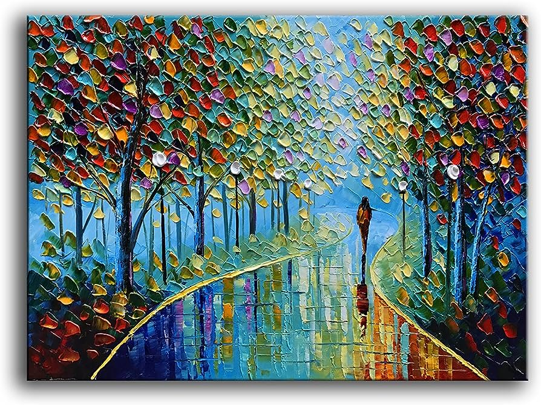
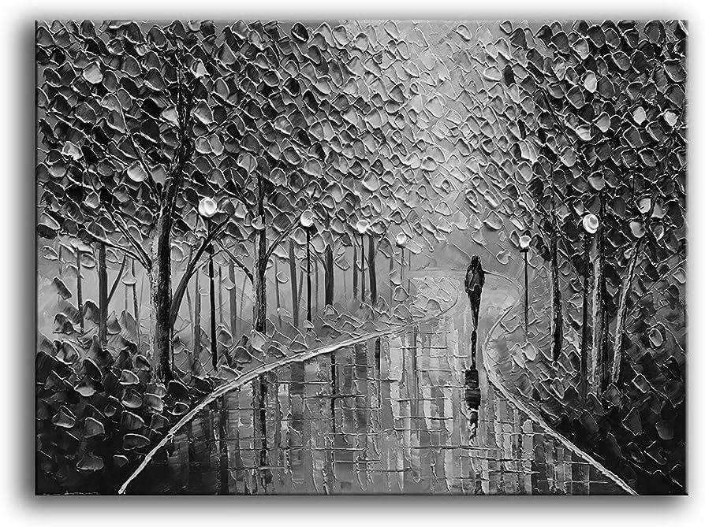
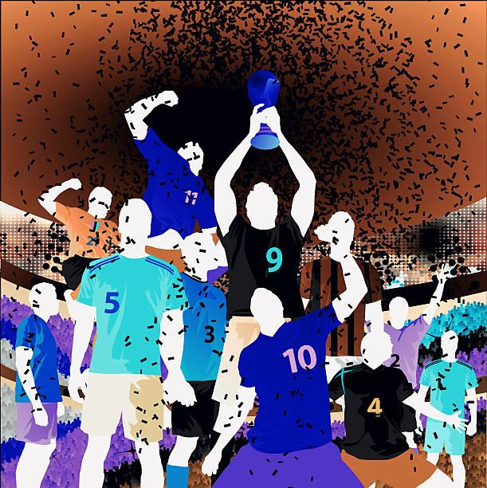

# Honors: Image Processing Project

## Part 1: Batch Image Grayscale Converter

### Summary

- This project creates **grayscale versions** of multiple images selected by the user as a batch.
- Creates copies of the original images.

### Examples

    <h4>Original</h4>
    
    <h4>Grayscale</h4>
    

## Part 2: Batch Image Inversion

### Summary

- This project creates **negatives / inversions** of multiple images selected by the user as a batch.
- Image negatives / inversion
  - In inverting an image, a pixel’s red, blue, and green components are modified to be the exact opposite within the 0 to 255 range.
  - If a pixel’s red, blue, and green values are (34, 198, 240), then that same pixel in the inverted image would have the red, blue and green values of (221, 57, 15). Note that 255 - 34 is 221, 255 - 198 is 57, and 255 - 240 is 15.

### Examples

    <h4>Original</h4>
    
    <h4>Inverted</h4>
    

