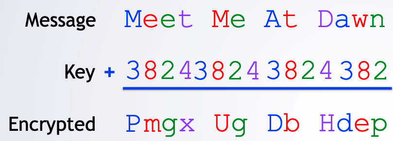

# Vigenère Cipher Breaker Project

### Introduction

- This project breaks strings that are encrypted using a Vigenère Cipher
- Vigenère cipher is a more complex version of Caesar Cipher. And uses Caesar Cipher cyclically.
- Vigenère cipher example
  - Original message: `Meet Me At Dawn`
  - Key: `"DICE" => [3, 8, 2, 4]`
  

       
   

### Methodology

- Uses the letter frequencies and Caesar Cipher to break the Vigenère Cipher.
- Principles used:
  - HashSet
  - HashMap
  - Object Oriented Design

### Assumptions

- Works only on the following languages (which have the same alphabet as English):
  - Danish
  - Dutch
  - English
  - French
  - German
  - Italian
  - Portuguese
  - Spanish
- Doesn't work when the language of the original message has multiple letters of comparable high frequency.
- Doesn't work when the language of the original message when written in sentences has different letter frequencies than the sum of individual words in the dictionary.
- Doesn't work he language of the original message has many characters not in the English alphabet.
- Doesn't work when the key length used is long compared to the original message.
