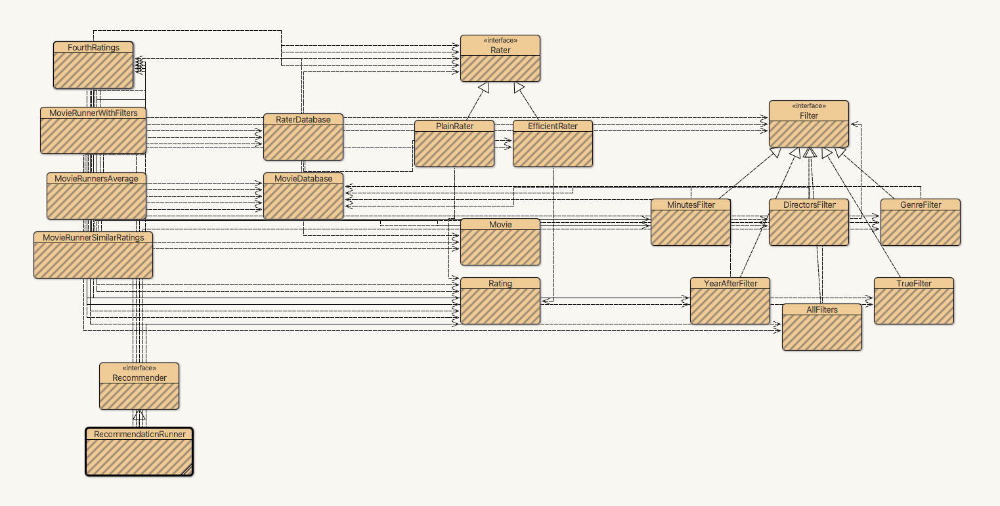

# Project: Building a Movie Recommendation System

## Summary

This capstone project creates a recommender systems. It works with data for movies, including ratings. It answer questions about the data, including which items should be recommended to a user based on their ratings of several movies. Given input files on users ratings and movie titles, it solves the following problems:

- Read in and parse data into lists and maps
- Calculate average ratings
- Calculate how similar a given rater is to another user based on ratings
- Recommend movies to a given user based on ratings
- Display recommended movies for a given user on a webpage

## Demonstration

You can find the demo [here](https://www.dukelearntoprogram.com/capstone/recommender.php?id=O8o7gwNjsIG0Yr)

1. Rate the movies shown on the first page (be sure to rate enough movies).
2. The recommender then shows you a list of movie recommendations (using collaborative filtering) based on your ratings.

## Methodology

- The basic recommendations are shown using just the **average rating** of the movie (from all users)
- The more advanced recommendations are calculated using **Collaborative Filtering**. Specifically, it does the following:

  1. Finds the **similarity rating** for the current rater with respect to all the remaining raters.
  2. **Sorts** all the raters in descending order (based on the similarity rating) and discards raters with negative similarity
     - Similarity is calculated as the **dot product of normalized ratings** of all the movies by two raters.
  3. Takes the top few similar raters and finds the **weighted average rating** for each movie, using the similarities of the top similar raters as the weights.
  4. Sorts the movies based on their **weighted average rating** in descending order and shows the top few movies as the recommendations.

## Class Diagram

    

